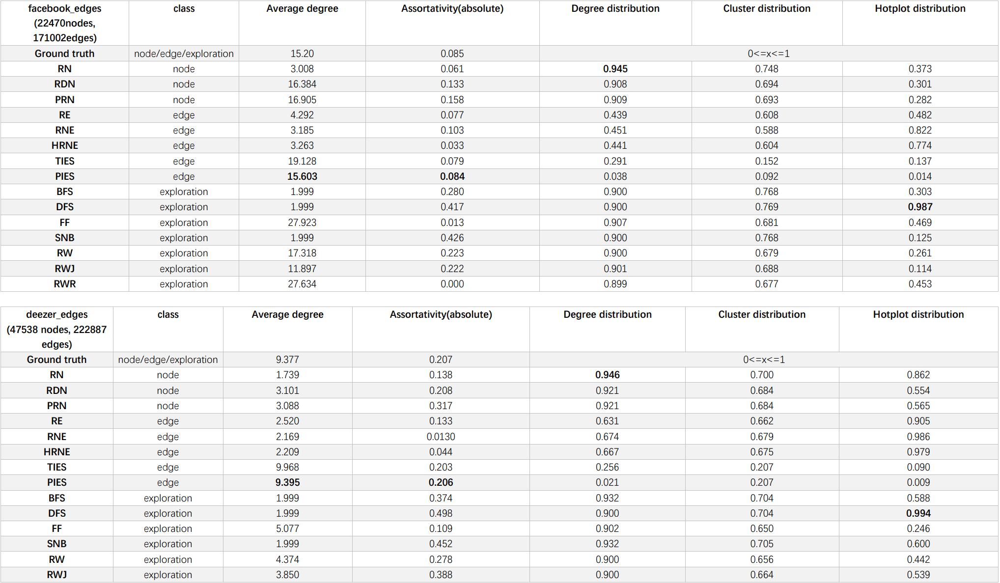
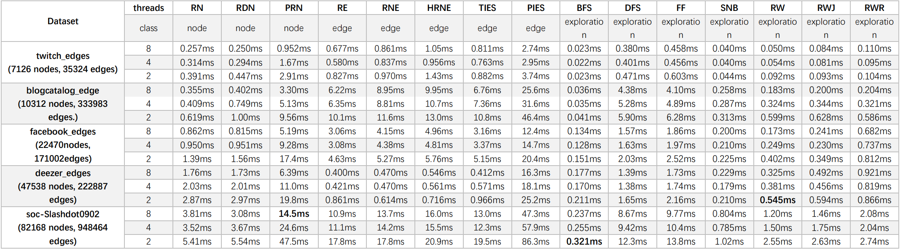

# Samplesys

Samplesys is a scalable system for large scale graph sampling system, including random nodes, random edges and
exploration based methods. And the engine supports OpenMP-based parallelism.

Also, it provides several graph sampling-based applications, like graph property estimation, node proximate estimation.


## Installation
This describes the installation process using cmake. As pre-requisites, you'll need git and cmake installed.

Dependencies
Building Samplesys requires the following to be installed:

* gfortran: `sudo apt install gfortran`

After that, you may download and build the samplesys.
```shell
# Check out the library.
$ git clone https://github.com/samplesys/samplesys.git
# Go to the library root directory
$ cd samplesys
# Make a build directory to place the build output.
$ mkdir build
# Enter the build directory
$ cd build
# Generate build system files with cmake
$ cmake ..
# Build the library.
$ make
```

This builds the `libsampler.so` and `libbackend.so`, along with tests. On a unix system, the build directory should now look something like this:

```bash
/samplesys
    /build
        /libbackend.so
        /libsampler.so
        /bm...
        /test...
```

## Running examples
In the /example directory we provide 3 example cpp program: `testAnalysis.cpp`, `testGraphStream.cpp` and `testSampler.cpp`.

* In `testGraphStream.cpp`, we show the function of reading a graph from/to a text/binary file.
* In `testSampler.cpp`, we use the user-specific sampler to sample the input graph and output to a file.
* In `testAnalysis.cpp`, we utilize most analysis functions in order to get the descriptive efficients from given graph(and original graph).

To get the instruction how to start with these examples, please excute them directly after installing the samplesys.

For example, to excute the Sampler test.
```shell
$ ./build/testSampler
[Usage]: ./build/testSampler path/to/input path/to/output
[Options]:
        --directed/undirected, default directed.
        --percent <num>         Percent of graph to be sampled, default 0.1.
        --method <name>         Sample method(rn/rdn/prn/re/ff), default "rn"
```

Try to use the Sampler test.
```shell
# Need to create the result directory first.
$ ./build/testSampler example/input/facebook_edges.csv result/subgraph.txt --directed --percent 0.2 --method rdn
Time taken by rdn: 108774 microsecond
```
Now, the sampled graph is saved into result/subgraph.txt.

*To test the samplesys more efficiently, you may use the bash files*
*in the /test directory.*


---

## Evaluation

### Test environment

* Hardware: 56 Intel(R) Xeon(R) Gold 5120 CPU @ 2.20GHz with 28 Cores(14 per socket) 
and 157GB memory
* Dataset:

|Dataset|Type|Nodes|Edges|Description|
| ------------------------------------------------------------ | ---------- | ------ | ------- | ------------------------------------------------------------ |
| [twitch-EN](http://snap.stanford.edu/data/twitch-social-networks.html) | Undirected | 7,126  | 35,324  | Social networks of Twitch users.                             |
| [blogcatalog](https://networkrepository.com/soc-BlogCatalog.php)(part) | Undirected | 10,312 | 333,983 | Social network of bloggers in the BlogCatalog website.       |
| [facebook](http://snap.stanford.edu/data/facebook-large-page-page-network.html) | Undirected | 22,470 | 171,002 | Page-page graph of verified Facebook sites.                  |
| [deezer-HU](http://snap.stanford.edu/data/gemsec-Deezer.html) | Undirected | 47,538 | 222,887 | Friendship networks of users from 3 European countries.      |
| [soc-Slashdot0902](http://snap.stanford.edu/data/soc-Slashdot0902.html) | Directed   | 82,168 | 948,464 | User-submitted and editor-evaluated technology oriented news. |

### Time test


### Functional test



## Generate Doc with Doxygen

### Install tools

```shell
sudo apt install graphviz
sudo apt install doxygen
```

### Generate document

```shell
doxygen Doxygen.config
```


## Third-party libs

These are third-party packages installed in the project:

* Armadillo (installed when building)
* arpack (lib/3_party)
* LAPACK 3.10.1 (lib/3_party)
* OpenBLAS 0.3.20 (lib/3_party)
* SuperLU 5.3.0 (lib/3_party)
* Benchmark 1.6.1 (lib/3_party)

### Armadillo

Armadillo is a high quality C++ library for linear algebra and scientific computing, aiming towards a good balance
between speed and
ease of use.The library can be used for machine learning, pattern recognition, computer vision,signal processing,
bioinformatics, statistics, finance, etc.

Download link: http://arma.sourceforge.net/

### Google Benchmark

A library to benchmark code snippets, similar to unit tests.

Download link: https://github.com/google/benchmark

## Future
* Provide samplers for random walk based NRL models.
* Provide Python interface to popular graph neural network repos such as NetworkX.

## License

[GNU General Public License v3.0](https://github.com/samplesys/samplesys/blob/main/LICENSE)